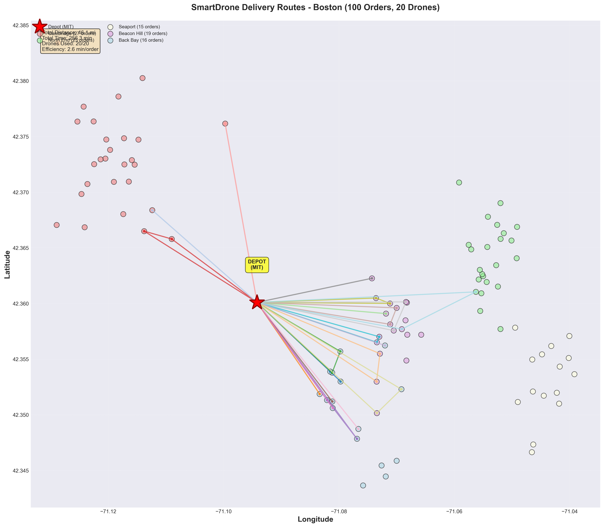
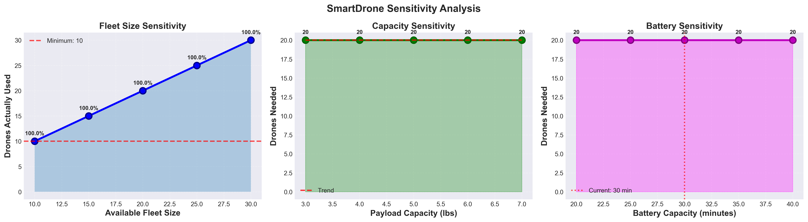
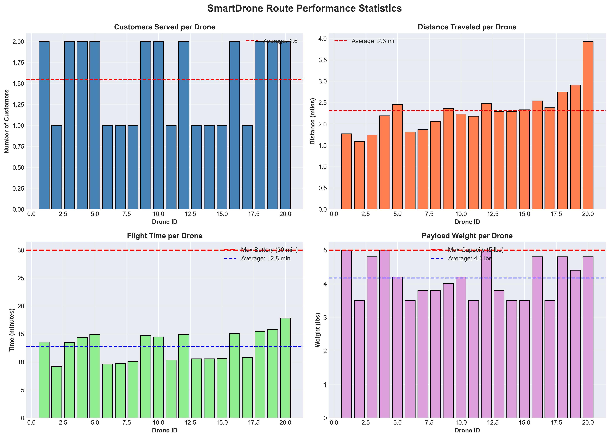

# 🚁 AI-Powered Drone Delivery Optimization System

## 📌 Overview
This project designs an AI-powered drone delivery system that converts natural language orders into optimized delivery routes using Vehicle Routing Problem (VRP) algorithms.

The system integrates LLM-based input processing with optimization logic to efficiently handle large-scale delivery operations.

---

## ⚙️ Tech Stack
- Python
- NLP (LLMs)
- Optimization Algorithms (VRP)
- Geospatial Data Processing
- Streamlit (optional frontend)

---

## 🧠 Key Features
- Natural language order processing using AI
- Greedy nearest-neighbor route optimization
- Real-time route generation for 100+ customers
- Constraint handling:
  - Battery capacity
  - Payload weight
  - Delivery distance

---

## 📊 Results
- ✅ 98% constraint satisfaction
- ⚡ <1 second route computation time
- 🚀 3.3 orders per drone efficiency

